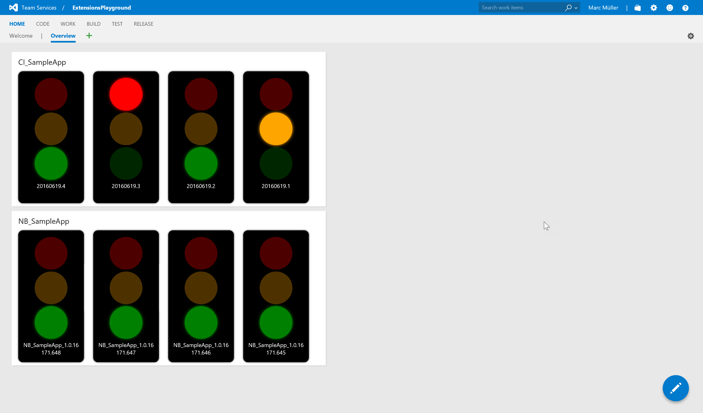

# Build Traffic Lights

This repository contains the source code for a VSTS / TFS extensions which allows you to add widgets to the dashboard which visualize the build state as a traffic light.
The code originated as a sample code for a german professional journal and was therefore made public available for the readers.
This extension should show you how to start developing a custom extension for VSTS and/or TFS. 

You can install or download the extension from the marketplace: [https://marketplace.visualstudio.com/items?itemName=4tecture.BuildTrafficLights](https://marketplace.visualstudio.com/items?itemName=4tecture.BuildTrafficLights)

### Screenshots

### Features

- The build state is represented as a traffic light.
- Each traffic light needs a 1x2 widget tile. If the widget is large enough, the last n build states are also shown.
- If a build is queued but not started, the yellow light is blinking.
- If a build is running, all lights are blinking. 
